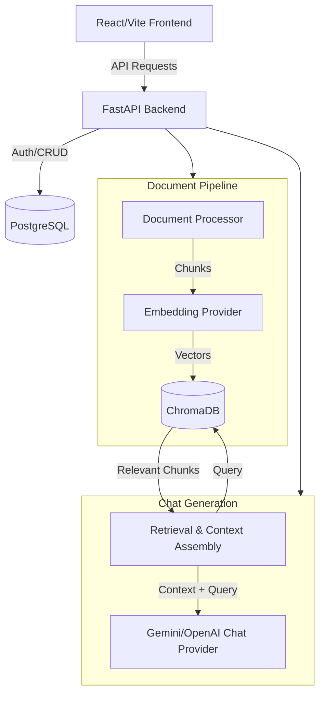

# DocuMind AI

Grounded AI answers from your documents.

DocuMind AI is a modern SaaS application that lets you upload your documents, build an isolated knowledge base, and chat with your content using advanced Retrieval-Augmented Generation (RAG). It provides answers backed by explicitly validated source citations, ensuring you always know where the AI got its information.

## Why DocuMind AI

Standard AI chat models can hallucinate or lack access to your specific internal knowledge. DocuMind AI solves this by grounding the AI's generation exclusively in the documents you provide. Users upload documents, build an indexed knowledge base, select specific documents, and ask grounded questions with validated source citations.

## Features

- **Document Ingestion**: PDF, DOCX, TXT, and MD upload support.
- **Robust Processing**: Intelligent text extraction and chunking.
- **Semantic Search**: Fast and accurate retrieval using state-of-the-art embedding models.
- **Multi-Document RAG**: Assemble context from multiple documents seamlessly.
- **Provider Abstraction**: Configure either Google Gemini or OpenAI as the active AI provider.
- **Data Isolation**: Provider, model, and dimension-isolated vector collections prevent data corruption.
- **Source-Backed Answers**: Every fact in the AI's answer is grounded.
- **Validated Citations**: Interactive citation metadata (`[SOURCE X]`) maps exactly to the retrieved chunk.
- **Chat Management**: Persistent chat sessions.
- **Security First**: JWT authentication, per-user data isolation, and prompt-injection defenses.
- **Resilience**: Provider failure normalization, timeouts, and document-scoped vector rollback on failure.
- **Observability**: Request correlation (`X-Request-ID`) and structured latency logging.
- **Premium Frontend**: Responsive React 18 frontend with an intuitive three-panel SaaS shell.

## Architecture



## RAG Pipeline

1. **Upload**: Users upload supported documents securely.
2. **Extract & Chunk**: Text is parsed and split into overlapping chunks for optimal retrieval.
3. **Embed & Index**: The chosen provider (Gemini or OpenAI) generates vector embeddings, which are stored in ChromaDB.
4. **Retrieve**: User queries are embedded and compared against the indexed chunks.
5. **Assemble Context**: The most relevant chunks are compiled into a strict context prompt.
6. **Generate**: The LLM synthesizes an answer explicitly constrained to the provided context.
7. **Validate**: Citations are structurally validated before reaching the user.

## Security and Reliability

- **Authentication**: Bearer JWT authentication controls access to all endpoints.
- **Isolation**: Strict ownership checks at the database and vector level ensure users only see their own data.
- **Prompt Injection Defense**: Explicit system prompts block the LLM from executing malicious user instructions.
- **Resilience**: The backend normalizes provider exceptions (rate limits, timeouts) into safe, user-friendly HTTP errors.
- **Transactions**: Document ingestion features scoped rollbacks (e.g., deleting partial vectors if an upload fails).

*(Note: The frontend currently stores the bearer JWT in `localStorage` for demonstration purposes. A strict production deployment should migrate this to an HttpOnly cookie.)*

## Tech Stack

- **Frontend**: React 18, TypeScript 5, Vite, Tailwind CSS v3, React Router v6
- **Backend**: Python 3.12, FastAPI, SQLAlchemy (Async), Alembic
- **AI Integration**: Google GenAI SDK (Gemini), OpenAI SDK
- **Vector Database**: ChromaDB (Local Persistent)
- **Database**: PostgreSQL 15
- **Testing**: Pytest (Backend), Vitest (Frontend)
- **Infrastructure**: Docker, Docker Compose

## Project Structure

```
rag-document-assistant/
├── backend/
│   ├── app/                # FastAPI application
│   │   ├── api/            # Route handlers
│   │   ├── core/           # Configuration and security
│   │   ├── models/         # SQLAlchemy ORM models
│   │   └── services/       # RAG, Vector Store, LLM logic
│   ├── tests/              # Pytest suite
│   └── migrations/         # Alembic migrations
├── frontend/
│   ├── src/
│   │   ├── components/     # React components
│   │   ├── context/        # Auth Context
│   │   ├── lib/            # API client
│   │   └── App.tsx         # Main application routing
│   └── Dockerfile          # Multi-stage Vite/Nginx build
└── docker-compose.yml      # Local product stack
```

## Local Setup

### Prerequisites
- Docker and Docker Compose
- Node.js 20+ (for local frontend development)
- Python 3.12+ (for local backend development)

### Quick Start with Docker

1. **Clone the repository:**
   ```bash
   git clone <your-repository-url>
   cd rag-document-assistant
   ```

2. **Configure Environment:**
   ```bash
   # Backend
   cp backend/.env.example backend/.env
   # Edit backend/.env and add your GEMINI_API_KEY
   ```

3. **Start the Stack:**
   ```bash
   docker compose up --build -d
   ```

4. **Run Database Migrations:**
   ```bash
   docker compose exec backend alembic upgrade head
   ```

5. **Access the Application:**
   - Frontend: [http://localhost:3000](http://localhost:3000)
   - Backend API Docs: [http://localhost:8000/api/v1/docs](http://localhost:8000/api/v1/docs)

## Environment Variables

**Backend (`backend/.env`) Required:**
- `DATABASE_URL`: PostgreSQL connection string
- `AI_PROVIDER`: `gemini` or `openai`
- `GEMINI_API_KEY`: Your Google Gemini API key (if using Gemini)
- `OPENAI_API_KEY`: Your OpenAI API key (if using OpenAI)
- `JWT_SECRET`: Secure random string for token generation

*Note: Frontend configuration like `VITE_API_BASE_URL` is embedded during build time and must not contain secrets.*

## Running Tests

**Backend:**
```bash
cd backend
python -m pytest
```

**Frontend:**
```bash
cd frontend
npm run test
npm run lint
npx tsc --noEmit
npm run build
```

## API Overview

- `/api/v1/auth`: Registration, login, and `/me` verification.
- `/api/v1/documents`: Upload, list, process, index, and delete documents.
- `/api/v1/chats`: Session management and grounded RAG querying.

## Known Limitations

- **JWT Storage**: Tokens are currently stored in `localStorage`.
- **Streaming**: The LLM response is not currently streamed via SSE; the frontend uses a static loading state.
- **Pagination**: Chat histories load completely without pagination.
- **Focus Trap**: The accessibility focus trap for the New Chat modal relies on browser defaults and is not strictly WCAG Level AA compliant.

## Roadmap

- Implement HttpOnly cookie authentication.
- Add streaming responses (SSE).
- Implement cursor-based pagination for chat sessions.
- Introduce comprehensive WCAG accessibility audits.
- Provide Terraform/Pulumi templates for cloud deployment.
