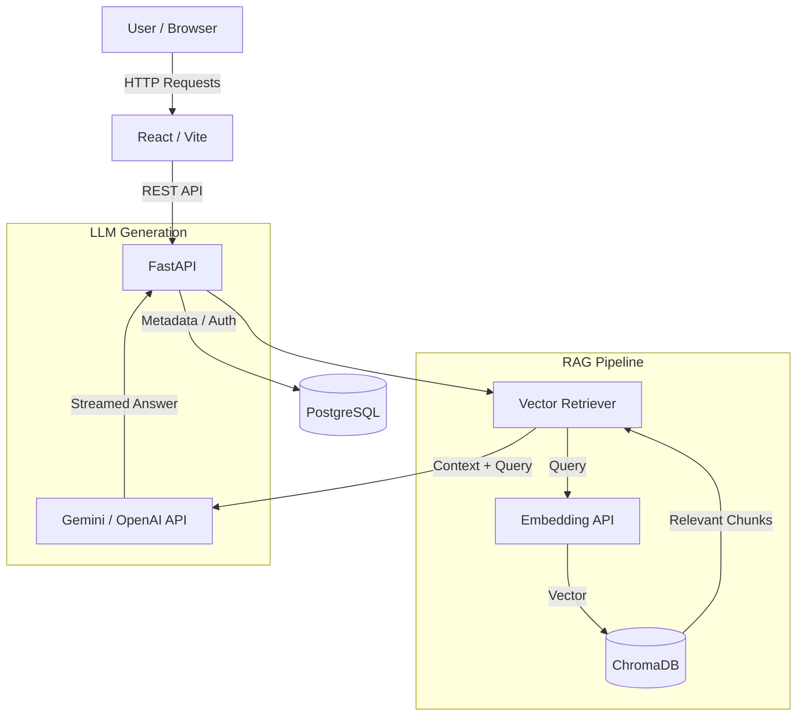
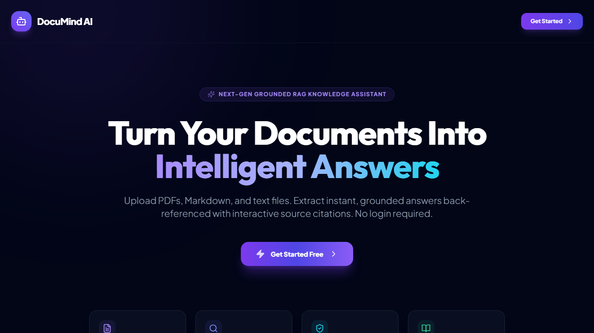
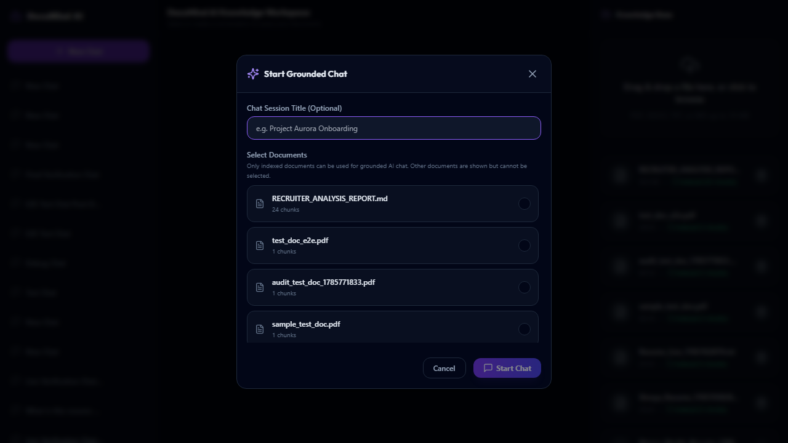

<div align="center">
  
  # DocuMind AI
  
  **AI-powered document assistant for grounded question answering**

  [](https://fastapi.tiangolo.com/)
  [](https://react.dev/)
  [](https://www.postgresql.org/)
  [](https://render.com/)

</div>

---

## Project Overview

DocuMind AI is a full-stack Retrieval-Augmented Generation (RAG) application. Users can upload PDFs or text documents to an isolated knowledge base. The system extracts the text, applies intelligent chunking, and generates vector embeddings stored in ChromaDB. When a user asks a question, the system retrieves the most semantically relevant document chunks and uses Google Gemini (or OpenAI) to synthesize a grounded answer, complete with strict source citations. 

This project was built to demonstrate full-stack engineering, system design, and applied AI integration.

## ✨ Features

- **Document Ingestion**: Upload PDF, DOCX, TXT, and Markdown files.
- **Automatic Document Processing**: Intelligent text extraction and chunking algorithms.
- **Semantic Vector Search**: Stores and retrieves document embeddings using ChromaDB.
- **RAG-based Question Answering**: Assembles retrieved context to answer user queries accurately.
- **Source Citations**: AI responses include citation markers mapping to specific document chunks.
- **Multi-Document Support**: Select and query multiple indexed documents simultaneously in a single chat.
- **Conversation History**: Chat sessions remember previous turns for follow-up questions.
- **Streaming Responses**: Real-time token-by-token generation using Server-Sent Events (SSE).
- **Responsive React UI**: A clean, modern interface built with Tailwind CSS.

## 🏗️ Architecture


```mermaid
flowchart TD
    User[User / Browser] -->|HTTP Requests| Frontend[React / Vite]
    Frontend -->|REST API| Backend[FastAPI]
    
    Backend -->|Metadata / Auth| DB[(PostgreSQL)]

    subgraph RAG Pipeline
        Retriever[Vector Retriever]
        EmbeddingModel[Embedding API]
        VectorStore[(ChromaDB)]

        Retriever -->|Query| EmbeddingModel
        EmbeddingModel -->|Vector| VectorStore
        VectorStore -->|Relevant Chunks| Retriever
    end

    Backend --> Retriever

    subgraph LLM Generation
        LLM[Gemini / OpenAI API]
        Retriever -->|Context + Query| LLM
        LLM -->|Streamed Answer| Backend
    end
```

## 🛠️ Tech Stack

- **Frontend**: React 18, TypeScript, Vite, Tailwind CSS, React Router v6.
- **Backend**: Python 3.12, FastAPI, SQLAlchemy (Async), Alembic, Pydantic.
- **AI Integration**: Google GenAI SDK (Gemini), OpenAI SDK.
- **Database**: PostgreSQL 15 (Relational), ChromaDB (Vector).
- **Deployment**: Docker, Docker Compose, Render.
- **Dev Tools**: Git, Pytest, Vitest.

## 🚀 Installation

### Prerequisites
- Docker and Docker Compose
- Node.js 20+ (for local frontend development)
- Python 3.12+ (for local backend development)

### 1. Clone the repository
```bash
git clone https://github.com/Shreya71703/documind-ai.git
cd documind-ai
```

### 2. Environment Variables
Copy the example environment file for the backend:
```bash
cp backend/.env.example backend/.env
```
Edit `backend/.env` and add your `GEMINI_API_KEY` (or `OPENAI_API_KEY`).

### 3. Start the Stack (Docker)
Run the complete application stack (PostgreSQL, ChromaDB, FastAPI, and Nginx/React) using Docker Compose:
```bash
docker compose up --build -d
```

### 4. Run Database Migrations
Initialize the PostgreSQL database schema:
```bash
docker compose exec backend alembic upgrade head
```

### 5. Access the Application
- **Frontend UI**: [http://localhost:3000](http://localhost:3000)
- **Backend API Docs**: [http://localhost:8000/api/v1/docs](http://localhost:8000/api/v1/docs)

## 📸 Screenshots

<p align="center">
  
</p>

<p align="center">
  
</p>

## 🔮 Future Improvements

- **OCR Support**: Extract text from scanned PDFs and images.
- **Cloud Vector Storage**: Migrate from local ChromaDB to a managed vector database like Pinecone for better scale.
- **Hybrid Retrieval**: Combine keyword search (BM25) with semantic vector search for higher accuracy.
- **Citation Highlights**: Visually highlight the exact sentence in the source document PDF when a citation is clicked.

## 📄 License

This project is licensed under the MIT License.
